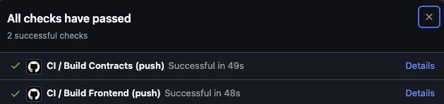
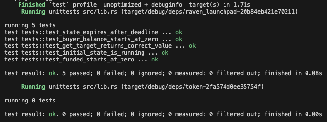
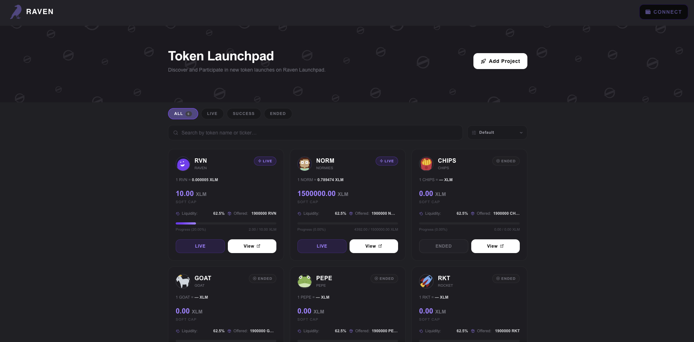

# Raven Launchpad

A multi-token launchpad (IDO) built on Stellar/Soroban. Contributors fund raises using native XLM. If the target is hit before the deadline, the launch succeeds and contributors claim project tokens. If not, everyone gets a full refund.

## Live Demo

> [https://raven-launchpad.vercel.app](https://raven-launchpad.vercel.app)

> 🎥 Demo Video: [Coming Soon](#)


---

## Screenshots

### Mobile Responsive UI


### CI/CD Pipeline



### Test Output


### Homepage


---

## How It Works

Raven Launchpad uses a simple raise-or-refund model across multiple simultaneous token launches:

1. A project sets a funding target and deadline in XLM
2. Contributors send XLM via `buy()` — contributions are tracked on-chain
3. If the target is reached before the deadline → state flips to **Success**; contributors call `claim()` to receive project tokens 1:1
4. If the deadline passes without hitting the target → state flips to **Expired**; contributors call `refund()` to get their XLM back

Each launch is an independent pair of Token + Launchpad contracts, registered in the frontend registry.

---

## Architecture

Two Soroban smart contracts power each launch, with a Next.js frontend on top.

```
.
├── contracts/
│   ├── launchpad/        # Core IDO logic — buy, claim, refund, state machine
│   └── token/            # Project token — mint, transfer, balance, allowance
└── app/                  # Next.js 14 frontend
    └── lib/
        └── launches.ts   # Multi-launch registry — add new projects here
```

### Contract Flow

Deploy token contract
Deploy launchpad contract
Initialize token  →  admin = launchpad contract address
Initialize launchpad  →  token, funding_token, target, deadline
Register both contract IDs in lib/launches.ts
Users call buy()  →  XLM transferred to launchpad, contribution tracked
If funded >= target  →  state flips to Success automatically
Users call claim()  →  launchpad mints project tokens 1:1 to contributor
If deadline passes without hitting target  →  state = Expired
Users call refund()  →  XLM returned to contributor


### Inter-Contract Communication

The key design pattern is the launchpad contract minting tokens on behalf of users after a successful raise. This uses Soroban's `authorize_as_current_contract` to pre-authorize the cross-contract mint call:

```rust
env.authorize_as_current_contract(vec![
    &env,
    InvokerContractAuthEntry::Contract(SubContractInvocation {
        context: ContractContext {
            contract: token_addr.clone(),
            fn_name: Symbol::new(&env, "mint"),
            args: (caller.clone(), balance).into_val(&env),
        },
        sub_invocations: vec![&env],
    }),
]);
```

This eliminates the need for users to sign a separate mint approval — the launchpad handles authorization atomically within the claim transaction.

---

## State Machine
                ┌─────────┐
                │ Running │  timestamp < deadline && funded < target
                └────┬────┘
                     │ funded >= target
                     ▼
                ┌─────────┐
                │ Success │  claim() available
                └─────────┘

                ┌─────────┐
                │ Expired │  timestamp >= deadline && funded < target
                └─────────┘  refund() available

---

## Live Launches (Testnet)

| Launch | Token | Token Contract | Launchpad Contract | Soft Cap |
|---|---|---|---|---|
| RAVEN | RVN | `CAKYJF4FRQMF3VS43THFNXB3RWCOHOXUEQE6JRCTEBRRLBD2I5CR23PB` | `CCHUVB7C4VB4QT7XCFOQFAJI4GTJNZTZE37GQY5H3UK53EYISSEVWUKH` | 1,000 XLM |
| NORMIES | NORM | `CACCNZESK5YAQYYN5NLZLBEJNNPTTNN3H5YK6ICWXEL65UVLGVHNP534` | `CDWEL3QFJ52UNTZFQVM3O424VYC63STQPI7OIMNQ6G2DA5CCFJM5X4JT` | 50,000 XLM |
| CHIPS | CHIPS | TBD | TBD | 1,000 XLM |
| GOAT | GOAT | TBD | TBD | 5,000 XLM |
| PEPE | PEPE | TBD | TBD | 2,000 XLM |
| ROCKET | RKT | TBD | TBD | 10,000 XLM |

**Funding Token (XLM SAC):** `CDLZFC3SYJYDZT7K67VZ75HPJVIEUVNIXF47ZG2FB2RMQQVU2HHGCYSC`

---

## Testnet Transactions

### Inter-Contract Call — Claim (Launchpad → Token Mint)

| | |
|---|---|
| **Transaction** | `fadc55b6446caddb9aaf53fb0ca81fb0e83dac9be7dc9bf3c0c6978d1027d84f` |
| **Explorer** | [View on Stellar Expert](https://stellar.expert/explorer/testnet/tx/fadc55b6446caddb9aaf53fb0ca81fb0e83dac9be7dc9bf3c0c6978d1027d84f) |
| **Action** | Launchpad calls `token.mint()` via `authorize_as_current_contract` |

---

## Adding a New Launch

Each new project requires deploying a fresh Token + Launchpad pair. The wasm is already uploaded to testnet so you only need to deploy new instances:

```bash
# 1. Deploy new token instance from existing wasm hash
stellar contract deploy \
  --wasm-hash <TOKEN_WASM_HASH> \
  --source deployer \
  --network testnet
export TOKEN_ID=<printed_id>

# 2. Deploy new launchpad instance
stellar contract deploy \
  --wasm-hash <LAUNCHPAD_WASM_HASH> \
  --source deployer \
  --network testnet
export LAUNCHPAD_ID=<printed_id>

# 3. Initialize token — admin MUST be the launchpad address
stellar contract invoke --id $TOKEN_ID --source deployer --network testnet \
  -- initialize --admin $LAUNCHPAD_ID

# 4. Initialize launchpad
export FUNDING_TOKEN=CDLZFC3SYJYDZT7K67VZ75HPJVIEUVNIXF47ZG2FB2RMQQVU2HHGCYSC
export DEADLINE=1800000000  # Jan 15 2027

stellar contract invoke --id $LAUNCHPAD_ID --source deployer --network testnet \
  -- initialize \
  --token $TOKEN_ID \
  --funding_token $FUNDING_TOKEN \
  --target <TARGET_IN_STROOPS> \
  --deadline $DEADLINE

# 5. Register in lib/launches.ts
```

Then add an entry to `lib/launches.ts`:

```ts
{
  id: "launch-N",
  name: "PROJECT NAME",
  ticker: "TKR",
  launchpadId: "<LAUNCHPAD_ID>",
  tokenId: "<TOKEN_ID>",
  softCap: 1000,
  liquidity: 62.5,
  offered: "1900000 TKR",
  icon: "https://emojicdn.elk.sh/🚀?style=twitter",
}
```

---

## Contract API

### Launchpad

| Function | Description |
|---|---|
| `initialize(token, funding_token, target, deadline)` | Configure the raise parameters |
| `buy(buyer, amount)` | Contribute XLM to the raise |
| `claim(caller)` | Claim project tokens after a successful raise |
| `refund(caller)` | Retrieve XLM after an expired raise |
| `get_state()` | Returns `0` (Running), `1` (Success), or `2` (Expired) |
| `get_funded()` | Total XLM raised so far (in stroops) |
| `get_target()` | Raise target (in stroops) |
| `get_buyer_balance(buyer)` | Individual contribution amount |

### Token

| Function | Description |
|---|---|
| `initialize(admin)` | Set admin — must be the launchpad contract address |
| `mint(to, amount)` | Mint tokens — only callable by admin (launchpad) |
| `balance(addr)` | Get token balance for an address |
| `transfer(from, to, amount)` | Transfer tokens between addresses |
| `total_supply()` | Total tokens minted |
| `approve(owner, spender, amount)` | Approve a spender allowance |
| `allowance(owner, spender)` | Check spender allowance |

---

## Getting Started

### Prerequisites

- Rust + `wasm32-unknown-unknown` target
- Stellar CLI
- Node.js 20+

```bash
rustup target add wasm32-unknown-unknown
cargo install --locked stellar-cli --features opt
```

### Build Contracts

```bash
cargo clean && cargo build --target wasm32-unknown-unknown --release
```

Compiled `.wasm` files output to:
target/wasm32-unknown-unknown/release/token.wasm

target/wasm32-unknown-unknown/release/launchpad.wasm

### Deploy to Testnet

```bash
# Set up and fund identity
stellar keys generate deployer --network testnet
stellar keys fund deployer --network testnet
export DEPLOYER=$(stellar keys address deployer)

# Deploy contracts
stellar contract deploy \
  --wasm target/wasm32-unknown-unknown/release/token.wasm \
  --source deployer --network testnet
export TOKEN_ID=<printed_id>

stellar contract deploy \
  --wasm target/wasm32-unknown-unknown/release/launchpad.wasm \
  --source deployer --network testnet
export LAUNCHPAD_ID=<printed_id>

# Initialize token — admin MUST be the launchpad address
stellar contract invoke --id $TOKEN_ID --source deployer --network testnet \
  -- initialize --admin $LAUNCHPAD_ID

# Initialize launchpad
export FUNDING_TOKEN=$(stellar contract id asset --asset native --network testnet)
export DEADLINE=1800000000  # Jan 15 2027

stellar contract invoke --id $LAUNCHPAD_ID --source deployer --network testnet \
  -- initialize \
  --token $TOKEN_ID \
  --funding_token $FUNDING_TOKEN \
  --target 10000000 \
  --deadline $DEADLINE
```

### Run the Frontend

```bash
npm install
npm run dev
```

Open [http://localhost:3000](http://localhost:3000)

---

## Testing the Full Flow

```bash
# 1. Contribute 1 XLM (10,000,000 stroops)
stellar contract invoke --id $LAUNCHPAD_ID --source deployer --network testnet --send yes \
  -- buy --buyer $DEPLOYER --amount 10000000

# 2. Check raise state (1 = Success if target was met)
stellar contract invoke --id $LAUNCHPAD_ID --source deployer --network testnet \
  -- get_state

# 3. Claim project tokens
stellar contract invoke --id $LAUNCHPAD_ID --source deployer --network testnet --send yes \
  -- claim --caller $DEPLOYER

# 4. Verify token balance
stellar contract invoke --id $TOKEN_ID --source deployer --network testnet \
  -- balance --addr $DEPLOYER

# 5. Attempt double-claim (expected to fail: "no tokens to claim")
stellar contract invoke --id $LAUNCHPAD_ID --source deployer --network testnet \
  -- claim --caller $DEPLOYER
```

---

## CI/CD

GitHub Actions runs on every push to `main`:

```yaml
# .github/workflows/ci.yml
- Build and lint contracts (Rust/Soroban)
- Run Soroban unit tests (3+ passing)
- Build Next.js frontend
- Deploy to Vercel on success
```

---

## Tech Stack

| Layer | Technology |
|---|---|
| Smart Contracts | Rust, Soroban SDK 21 |
| Blockchain | Stellar Testnet |
| Frontend | Next.js 14, TypeScript |
| Styling | Tailwind CSS v4 |
| Wallet Integration | `@creit.tech/stellar-wallets-kit` |
| Animations | Framer Motion |
| Deployment | Vercel |
| CI/CD | GitHub Actions |
